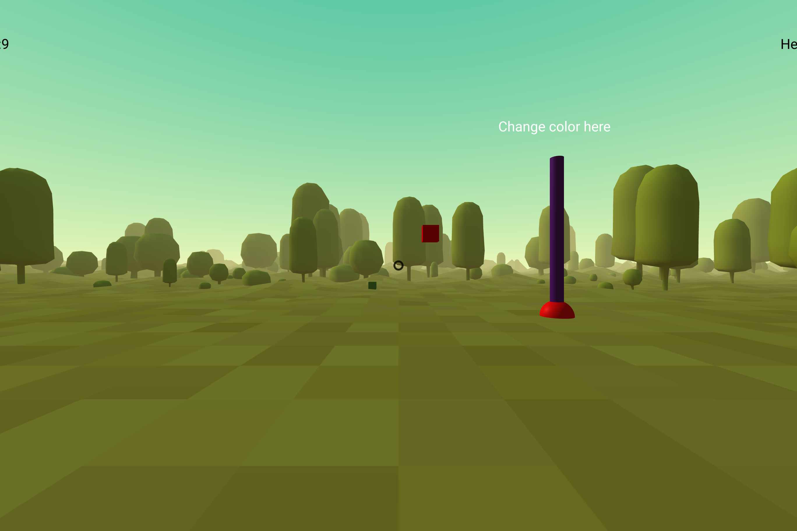

# 🚀 Yixuan Sun | STEM Innovator & Athlete

> **"Turning logic into reality through code, and building discipline through every lap in the pool."**

---

### 👤 About Me
Hi! My name is **Yixuan Sun**. I am a STEM enthusiast with strong interests in:
* **Computer Science** (JavaScript, Python, Lua)
* **Advanced Mathematics** & Logical Problem-solving
* **Competitive Swimming** (Discipline & Perseverance)
* **Reading & Narrative Writing:** Exploring complex stories and articulating ideas through creative prose.

This portfolio showcases my journey from foundational coding to creating immersive 3D environments.

---

### 🛠 Technical Skills
| Category | Skills |
| :--- | :--- |
| **Languages** | JavaScript, Python, HTML/CSS, Lua, Luau |
| **Tools** | A-Frame, Scratch, GitHub, VS Code |
| **Soft Skills** | Narrative Writing, Logical Thinking, Goal Setting |

---
## Significant Experiences

### Building a Minecraft-Inspired Game
Scratch was what first sparked my interest in coding. Later, while taking coding courses through CodeWizardsHQ, I worked on a Minecraft-inspired game as one of my first major projects.
This experience was meaningful because it was the first time I realized that code is a creative tool. I learned that programming isn’t just about syntax—it’s about turning ideas into something real. That realization motivated me to continue learning and experimenting with code.

    
    
Screenshot of the 3D Minecraft-inspired environment developed with A-Frame.

### Watching the Olympic Swimming Trials
Watching the Olympic swimming trials was what inspired me to start swimming competitively. 
I previously played soccer, but over time, I realized it wasn’t the right fit for me. With encouragement from my mom, I tried swimming and eventually came to love it.
This experience taught me the importance of exploring new interests and committing fully to something meaningful. 
The discipline and persistence I’ve developed through swimming have a strong influence on how I approach learning computer science.

## Goals
- Build meaningful software that can be useful in everyday life
- Continue developing my computer science skills through challenging projects
- Learn additional programming languages to expand my creative and technical abilities
- Compete at the highest level in swimming while maintaining academic growth

Thank you for taking the time to explore my work.

## My Projects
### (From codewizardshq)

- Minecraft A-Frame Game
  - View files on GitHub: [Click to view source code](https://github.com/chezzycheddars/yixuan-sun-portfolio/tree/main/minecraft-aframe-game)
  - Play (GitHub Pages): https://chezzycheddars.github.io/yixuan-sun-portfolio/minecraft-aframe-game/
  - Open in new tab: <a href="https://chezzycheddars.github.io/yixuan-sun-portfolio/minecraft-aframe-game/" target="_blank" rel="noopener">Minecraft A-Frame Game</a>
- Zen Survey
  - View files on GitHub: [Click to view source code](https://github.com/chezzycheddars/yixuan-sun-portfolio/tree/main/zen-survey)
  - Launch (GitHub Pages): https://chezzycheddars.github.io/yixuan-sun-portfolio/zen-survey/
  - Open in new tab: <a href="https://chezzycheddars.github.io/yixuan-sun-portfolio/zen-survey/" target="_blank" rel="noopener">Zen Survey</a>
- Pixel Pals! 
  - View files on GitHub:[Click to view source code](https://github.com/chezzycheddars/yixuan-sun-portfolio/tree/main/pet-simulator)
  - Launch (GitHub Pages): https://chezzycheddars.github.io/yixuan-sun-portfolio/pet-simulator/
  - Open in new tab: <a href="https://chezzycheddars.github.io/yixuan-sun-portfolio/pet-simulator/" target="_blank" rel="noopener">Pixel Pals!</a>

## Swimming
Learn about my competitive swimming journey:  
[View Swimming Portfolio](swimming/)

## Curiosity 
See the hobbies I explore:  
[View Curiosity Portfolio](curiosity/)
