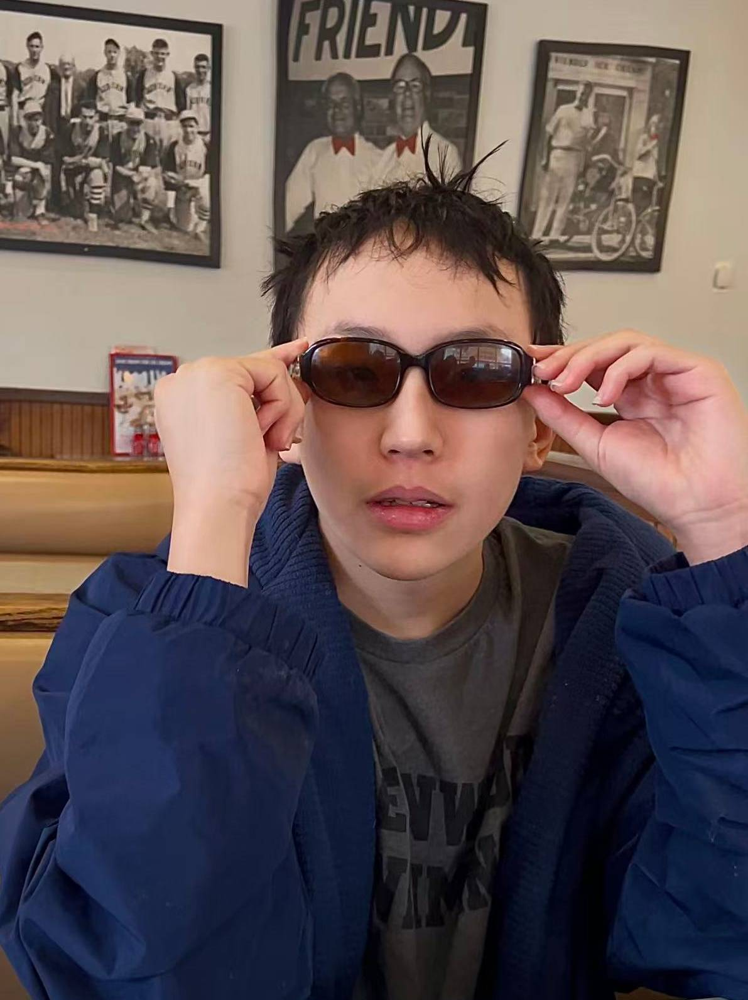
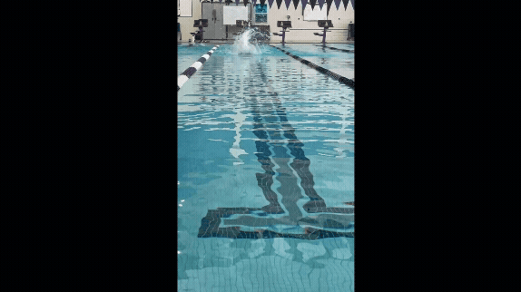

  <a href="https://chezzycheddars.github.io/yixuan-sun-portfolio/" style="text-decoration: none !important; border: none !important;">
    <h1 style="color: #007bff !important; border-bottom: none !important; margin-bottom: 0; font-family: sans-serif; letter-spacing: 2px;">
      YIXUAN SUN | OFFICIAL PORTFOLIO
    </h1>
  </a>

  <i>
    <b>Heritage & Identity Note:</b> This GitHub account ( <a href="https://github.com/chezzycheddars" style="color: #444; text-decoration: underline;"><b>chezzycheddars</b></a> ) was established in December 2023 when I was 11 years old. While the username reflects my childhood curiosity at that time, the projects showcased here represent my academic growth leading into the 2026 admissions season.
  </i>

<h1 align="center" style="margin-top: 50px; color: #333; font-family: sans-serif;">
  🚀 Yixuan Sun &nbsp;|&nbsp; STEM Innovator, Athlete & Analytical Thinker
</h1>

> **"Turning logic into reality through code, and building discipline through every lap in the pool, and exploring human complexity through deep narrative."**

---

  
   
 <strong>About Me</strong>

Hi! My name is **Yixuan Sun**. I am a 13-year-old 8th-grade student at **Robert E. Melican Middle School** in Northborough, MA. And a STEM enthusiast with strong interests in:

* 💻 **[Computer Science](#my-projects):** (JavaScript, Python, Lua) — Creating immersive 3D worlds like [Minecraft A-Frame](https://chezzycheddars.github.io/yixuan-sun-portfolio/minecraft-aframe-game/), [Pixel Pals](https://chezzycheddars.github.io/yixuan-sun-portfolio/pet-simulator/), and [Zen Survey](https://chezzycheddars.github.io/yixuan-sun-portfolio/zen-survey/).
  

    
<b>🎓 Click to view High School CS Academic Track details.</b>

    <ul>
      <li><b>Program:</b> Currently mastering the <a href="https://parents.codewizardshq.com/courses?tab=HIGH">High School Core Track</a> at CodeWizardsHQ.</li>
      <li><b>Mastery:</b> Advanced Backend Logic, Database Management, and API Integration.</li>
      <li><b>Professional Framework:</b> Building web applications using <b>Flask</b> (Industry-standard Python framework).</li>
    </ul>
  

* 📐 **[Advanced Mathematics](Yixuan_Sun_Stanford_Mathematics_Thinking_Certificate.pdf):** & Logical Problem-solving — Completed **[Introduction to Mathematical Thinking(Verified Credential: BKANKZ6HMI5I)](https://coursera.org/share/0fb05a1fae7961395476e1c50d340cea)** by Stanford University. I prioritize deep logical inquiry over traditional competition-based math, focusing on building a rigorous foundational framework to solve complex, real-world problems.
  

    
<b>🎓 Click to view Mastery & Core Competencies.</b>

    <ul>
      <li><b>Status:</b> `Course Completed 100%` — Focused on high-level logical proofs that transcend standard testing.</li>
      <li><b>Core Skills:</b> Advanced Symbolic Logic, Number Theory, and rigorous Mathematical Proofs.</li>
      <li><b>Outcome:</b> Developed the complex analytical patterns required for competitive STEM environments.</li>
    </ul>
  

* 🏊 **[Competitive Swimming](https://chezzycheddars.github.io/yixuan-sun-portfolio/swimming/):** (Discipline & Perseverance) — Dedicated athlete with [Official Results](https://chezzycheddars.github.io/yixuan-sun-portfolio/swimming/) and [Meet Highlights Video](https://youtu.be/3DjrPDhIGnI/).

* ✍️ **[Humanities & Analytical Writing](https://chezzycheddars.github.io/yixuan-sun-portfolio/curiosity/):** Science & Human Nature analysis. <a href="https://chezzycheddars.github.io/yixuan-sun-portfolio/Yixuan_Sun_Timed_Writing_Einstein.pdf.pdf" style="margin-left: 8px; color: #2a7ae2; text-decoration: none;">Timed Analysis: Einstein’s Humanity in 25 Minutes ➔</a>

*This portfolio showcases my journey from foundational coding to creating immersive 3D environments.*

---

## 🛠 Technical Skills 🏆

| Category | Skills |
| :--- | :--- |
| **Languages** | `JavaScript` `Python` `HTML/CSS` `Lua` `Luau` |
| **Tools** | `A-Frame` `Scratch` `GitHub` `VS Code` |
| **Professional Track** |  `Comprehensive CS Pathway Progress` — `Completed 95%+` (**[View 17 Certifications (2020-2025)](Professional_Development_Timeline_Yixuan_Sun.pdf)**) |
| **Academic Core** |  `Stanford: Introduction to Mathematical Thinking` —— **Grade: 89.66% (Honors • Top Performance)** (**[Detailed Grade Report](./Yixuan_Sun_Stanford_Math_Thinking_Grades.pdf)**) |
| **Soft Skills** | ⭐ `Narrative Writing` `Logical Thinking` `Goal Setting` |

---
## Significant Experiences

### Building a Minecraft-Inspired Game
Scratch was what first sparked my interest in coding. Later, while taking coding courses through CodeWizardsHQ, I worked on a Minecraft-inspired game as one of my first major projects.
This experience was meaningful because it was the first time I realized that code is a creative tool. I learned that programming isn’t just about syntax—it’s about turning ideas into something real. That realization motivated me to continue learning and experimenting with code.

  
  
A 3D immersive environment developed using A-Frame, featuring interactive block placement and spatial logic.

### Watching the Olympic Swimming Trials
Watching the Olympic swimming trials was what inspired me to start swimming competitively. 
I previously played soccer, but over time, I realized it wasn’t the right fit for me. With encouragement from my mom, I tried swimming and eventually came to love it.
This experience taught me the importance of exploring new interests and committing fully to something meaningful. 
The discipline and persistence I’ve developed through swimming have a strong influence on how I approach learning computer science.

  
   
  <em>Self-guided Butterfly stroke training: Mastering power and rhythm at the YMCA; currently working on improving body undulation and timing of the second kick.</em>

## Goals

- **Build innovative software solutions** that bridge the gap between complex logic and everyday utility.
- **Deepen expertise in competitive STEM research**, deepening my expertise in STEM by intentionally choosing deep logical inquiry over standardized math competitions like the AMC. My core goal is to dedicate my time and energy to authentic academic research and qualify for elite programs such as **MIT PRIMES**. Through exploring advanced mathematical theories, I aim to evolve into an independent thinker with the capacity for professional-level research.
- **Master additional programming paradigms**, expanding from creative 3D environments to high-performance algorithmic development.
- **Achieve excellence in competitive swimming** by reaching the New England Championships while maintaining a rigorous and balanced academic growth.

Thank you for taking the time to explore my work.

## My Projects
### (From codewizardshq)

- Minecraft A-Frame Game
  - View files on GitHub: [Click to view source code](https://github.com/chezzycheddars/yixuan-sun-portfolio/tree/main/minecraft-aframe-game)
  - Play (GitHub Pages): https://chezzycheddars.github.io/yixuan-sun-portfolio/minecraft-aframe-game/
  - Open in new tab: <a href="https://chezzycheddars.github.io/yixuan-sun-portfolio/minecraft-aframe-game/" target="_blank" rel="noopener">Minecraft A-Frame Game</a>
- Zen Survey
  - View files on GitHub: [Click to view source code](https://github.com/chezzycheddars/yixuan-sun-portfolio/tree/main/zen-survey)
  - Launch (GitHub Pages): https://chezzycheddars.github.io/yixuan-sun-portfolio/zen-survey/
  - Open in new tab: <a href="https://chezzycheddars.github.io/yixuan-sun-portfolio/zen-survey/" target="_blank" rel="noopener">Zen Survey</a>
- Pixel Pals! 
  - View files on GitHub: [Click to view source code](https://github.com/chezzycheddars/yixuan-sun-portfolio/tree/main/pet-simulator)
  - Launch (GitHub Pages): https://chezzycheddars.github.io/yixuan-sun-portfolio/pet-simulator/
  - Open in new tab: <a href="https://chezzycheddars.github.io/yixuan-sun-portfolio/pet-simulator/" target="_blank" rel="noopener">Pixel Pals!</a>

## Swimming
Learn about my competitive swimming journey:  
[View Swimming Portfolio](swimming/)

## Curiosity & Humanities

See the hobbies I explore:  
[View Curiosity Portfolio](curiosity/)
