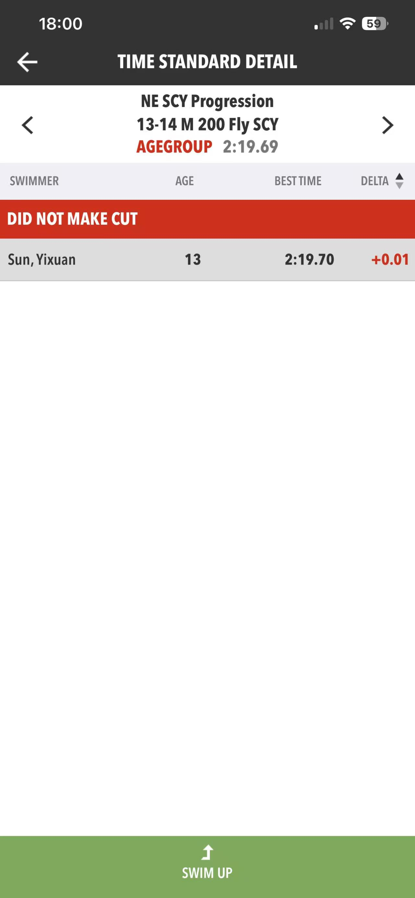
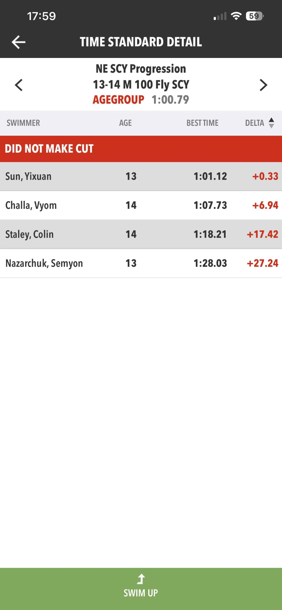
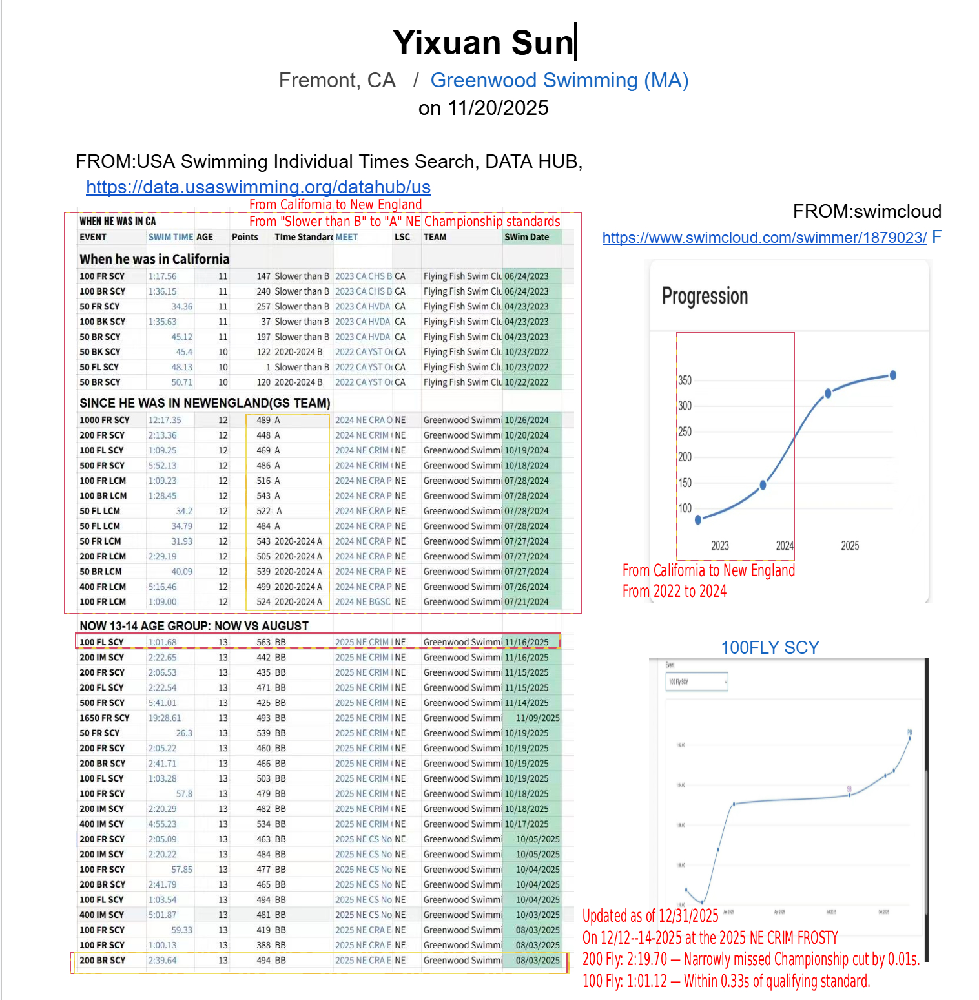

# Competitive Swimming

## Overview
I swim competitively for **Greenwood Swimming** in Massachusetts. Swimming has taught me **discipline, goal-setting, and perseverance**, lessons I carry into coding and other areas of life.  

## Highlights & Achievements

### Latest Meeting Highlights: 2025 NE CRIM FROSTY (Dec 12–14, 2024)

| Event | Your Time | **Championship Cut** | Status/Gap |
| :--- | :--- | :--- | :--- |
| **200 Yard Butterfly** | **2:19.70** | [**2:19.69**](https://www.gomotionapp.com/lscnes/UserFiles/Image/QuickUpload/11-14-ag-time-standards_004824.pdf) | 🔴 Missed by only **0.01s** |
| **100 Yard Butterfly** | **1:01.12** | [**1:00.79**](https://www.gomotionapp.com/lscnes/UserFiles/Image/QuickUpload/11-14-ag-time-standards_004824.pdf) | 🟡 Within **0.33s** of cut |

### **Personal Reflection: The Power of 0.01 Seconds**
> "Missing the Age Group Championship cut by just 0.01 seconds in the 200 Fly was a defining moment for me. It taught me that in elite competition, every detail matters—from the initial dive to the final touch. While it was a narrow miss, it serves as a powerful motivator, proving I am on the verge of a major breakthrough. This pursuit of precision is a mindset I now apply to both my swimming and my coding projects."

  
  
 
  <em>From SE Motion App.</em>

### My Growth & Resilience: California to New England

"What defines me is my resilience and consistent ability to achieve come-from-behind success. In 2023, I moved from California to Massachusetts and joined Greenwood Swimming. Starting with times 'Slower than B,' I embraced the challenge of the competitive New England circuit, transforming 'Slower than B' times into championship qualifications through a rigorous training regimen and qualified for the **New England 11-12 Age Group Championships** at age 12, the following year. The data below illustrates my progression and time standard achievements, captured from my final meet in 2022 through the data cutoff on November 20, 2025."

 
  

## Skills & Traits Developed Through Swimming
- Goal-setting & structured practice  
- Handling pressure and competition  
- Analyzing performance to improve  
- Physical endurance and mental resilience  

## Personal Reflection
Swimming is not just a sport; it’s a way I’ve learned to push boundaries. The lessons I gain in training and competition often translate directly to **coding and other creative projects**, where persistence and attention to detail are just as crucial.  

## Links
- [SwimCloud Profile](https://www.swimcloud.com/swimmer/1879023/)  
- [Swim Standards Team Page](https://swimstandards.com/clubs/ne/greenwood-swimming)

